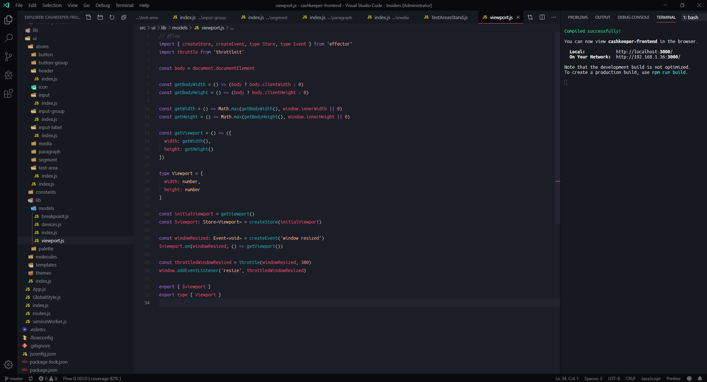

# My VSCode Settings

### Theme

[Horizon Theme](https://horizontheme.netlify.com/)

### Extensions

- [ESLint](https://marketplace.visualstudio.com/items?itemName=dbaeumer.vscode-eslint)
- [Flow Language Support](https://marketplace.visualstudio.com/items?itemName=flowtype.flow-for-vscode)
- [Horizon Theme](https://marketplace.visualstudio.com/items?itemName=jolaleye.horizon-theme-vscode)
- [Prettier - Code formatter](https://marketplace.visualstudio.com/items?itemName=esbenp.prettier-vscode)
- [Settings Sync](https://marketplace.visualstudio.com/items?itemName=Shan.code-settings-sync)
- [vscode-icons](https://marketplace.visualstudio.com/items?itemName=vscode-icons-team.vscode-icons)
- [vscode-styled-components](https://marketplace.visualstudio.com/items?itemName=jpoissonnier.vscode-styled-components)

### Settings file

Go to

- [settings.json](./settings.js) - unix
- [settings.json](./settings-for-windows.js) - windows

(it has .js extension in order to properly display comments on github)
